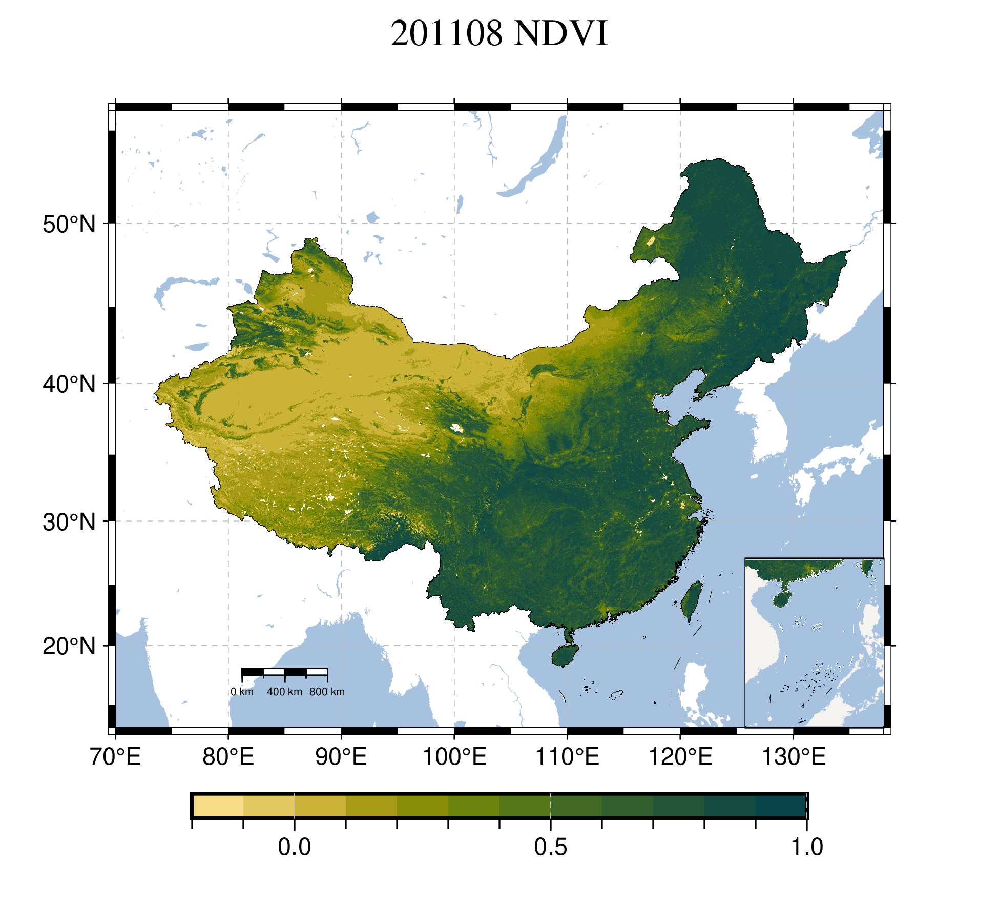

# 绘制MODIS NDVI 动图

- 2011到2020十年间中国8月份的NDVI变化情况

    

- 2017年3月到2018年2月（2017年四季）每月的NDVI变化情况

    

## usage

### 安装运行组件

#### 安装GMT

- 从Conda安装

    `conda install -c conda-forge gmt`

- 直接安装

    参照 [Windows 下安装 GMT — GMT 中文手册](https://docs.gmt-china.org/6.2/install/windows/)

#### 安装GraphicsMagick (为了生成动图)

- scoop 用户

    `scoop install GraphicsMagick`

- 直接安装

    从[GraphicsMagick 项目主页](https://sourceforge.net/projects/graphicsmagick/files/graphicsmagick-binaries/1.3.36/)下载安装包下载安装

#### 安装Visual Studio 2008 redistributable file（为了GraphicsMagick可以运行）

- 直接安装

    从[微软网站下载](https://docs.microsoft.com/en-US/cpp/windows/latest-supported-vc-redist?view=msvc-170#visual-studio-2008-vc-90-sp1-no-longer-supported)

### 运行

1. 修改`files_dir`
2. 运行`MakeMap.py`
3. 如果没有错误，运行结束后在`files_dir`目录中会有一个 GIF 文件夹，其中有生成的 gif 文件

## 数据

我已经将用到的MODIS数据文件名本别放在了[China-Aug-2011-2020-MOD13A3-FilesName.txt](China-Aug-2011-2020-MOD13A3-FilesName.txt)和[China-201703-201802-MOD13A3-FilesName.txt](China-201703-201802-MOD13A3-FilesName.txt)两个文本文件中。可以在LAADS网站的 [Filename Search 栏目](https://ladsweb.modaps.eosdis.nasa.gov/search/locate) 检索下载
